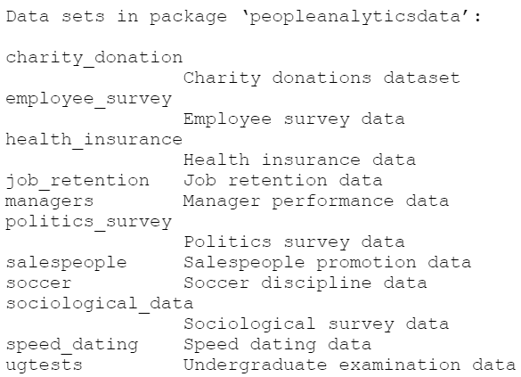

```{r setup, include=FALSE}
options(htmltools.dir.version = FALSE)
library(knitr)
knitr::opts_chunk$set(cache = TRUE, warning = FALSE, message = FALSE, dpi = 180,fig.width = 4.25, fig.height = 3.5)
library(silgelib)
library(ggplot2)
theme_set(theme_roboto())
```

layout: true

<div class='my-footer'><span>https://rladiestunis.github.io/useR-2021-ggplot2-tutorial/</span></div> 

---

class: inverse, center, middle

# Data visualization using ggplot2 and its extensions


.large[R-Ladies Tunis | <code><font color='#2166ac'>useR! 2021 Conference</font></code>  | 5 July 2021]

---

.pull-left1[
&nbsp;&nbsp;&nbsp;&nbsp; &nbsp;&nbsp;&nbsp;&nbsp;&nbsp;&nbsp;&nbsp;&nbsp;&nbsp;&nbsp;&nbsp;&nbsp;&nbsp;&nbsp;&nbsp;&nbsp;&nbsp;&nbsp;&nbsp;&nbsp;&nbsp;&nbsp;


**<code><font color='#88398a'>Haifa Ben Messaoud</font></code>**
&nbsp;&nbsp;&nbsp;&nbsp;&nbsp;&nbsp;&nbsp;&nbsp;&nbsp;&nbsp;&nbsp;&nbsp;&nbsp;&nbsp;&nbsp;&nbsp;
**<code><font color='#88398a'>Mouna Belaid</font></code>**

&nbsp;&nbsp;&nbsp; **<code><font color='#88398a'>Data Scientist</font></code>**
&nbsp;&nbsp;&nbsp;&nbsp;&nbsp;&nbsp;&nbsp;&nbsp;&nbsp;&nbsp;&nbsp;&nbsp;&nbsp;&nbsp;&nbsp;&nbsp;&nbsp;&nbsp;&nbsp;&nbsp;&nbsp;&nbsp;**<code><font color='#88398a'>Data Scientist</font></code>**


&nbsp;&nbsp;&nbsp;&nbsp;&nbsp;&nbsp;&nbsp;&nbsp;&nbsp;&nbsp;&nbsp;&nbsp;&nbsp;&nbsp;&nbsp;&nbsp;&nbsp;&nbsp;


&nbsp;&nbsp;&nbsp;&nbsp;
**<code><font color='#88398a'>Kaouthar Driss</font></code>**
&nbsp;&nbsp;&nbsp;&nbsp;&nbsp;&nbsp;&nbsp;&nbsp;&nbsp;&nbsp;&nbsp;&nbsp;&nbsp;&nbsp;&nbsp;&nbsp;&nbsp;&nbsp;&nbsp;&nbsp;&nbsp;&nbsp;&nbsp;&nbsp;&nbsp;&nbsp;&nbsp;&nbsp;&nbsp;&nbsp;
**<code><font color='#88398a'>Amir Souissi</font></code>**

**<code><font color='#88398a'>Data Science Engineer</font></code>**
&nbsp;&nbsp;&nbsp;&nbsp;**<code><font color='#88398a'>Consultant Data Scientist</font></code>**

]


.pull-right1[


# Find us at...

<a href='https://twitter.com/rladiestunis'><i class='fa fa-twitter fa-fw'></i>&nbsp; @rladiestunis</a><br>
<a href='https://github.com/rladiestunis'><i class='fa fa-github fa-fw'></i>&nbsp; @rladiestunis</a><br>
<a href='mailto:tunis@rladies.org'><i class='fa fa-paper-plane fa-fw'></i>&nbsp; tunis@rladies.org</a>
]

---

## Outline

1) Data presentation using the **peopleanalyticsdata** package

2) One-variable visualization 

  + Boxplot Viz

  + Barplot Viz

  + Density Histogram Viz

3) Two-variables visualization

  + Two categorical variables: geom_count,etc.

  + Two numeric variables: scatterplots, etc.

  + One categorical, one numeric: boxplots, etc.

---

## Outline

4) Correlation Matrix for three or more variable Viz

  + Augmenting one- and two-variable visualization with color, and other aesthetic mappings
  
5) Graph appearance enhancement

  + How to make your graphs look professional 

  + Adding RStudio logo 

  + Graph export options

---

## How to follow this workshop

- Workshop materials are available at the following [link](https://github.com/)

- Prerequisites: 

  - Basic proficiency in R
  - Some basic knowledge about different R data types & structures (character, numeric, data frame, etc.) 

- Possibility to communicate with Teacher Assistants for relevant questions about our training session

---

## Learning goals `r emo::ji('rocket')`

- Get a clear understanding of the ggplot2 R package and some of its extensions: ggprism, and GGally

--

- Design effective data visualization by choosing the appropriate ggplot2 geoms when selecting the data

--

- Make some visualization enhancements using professional plots

---

## What is the grammar of graphics?

- Google defines a **grammar** as “the whole system and structure of a language or of languages in general, usually taken as consisting of syntax and morphology (including inflections) and sometimes also phonology and semantics.”<sup>1</sup> 

--

- Others consider a **grammar** to be “the fundamental principles or rules of an art or science.<sup>2</sup> 

--

- Applied to visualizations, a **grammar of graphics** is a grammar used to describe and create a wide range of statistical graphics.<sup>3</sup> 

--

- The **layered grammar of graphics** approach is implemented in <code><font color='#2166ac'>ggplot2</font></code>, a widely used graphics library for R. All graphics in this library are built using a layered approach, building layers up to create the final graphic.

--

- The <code><font color='#2166ac'>ggplot2</font></code> is an abbreviation of **grammar of graphics plot**. The <code><font color='#2166ac'>ggplot2</font></code> is created by [Hadley Wickham](http://hadley.nz/).

--

- Hadley Wickham wrote a very interesting book [*ggplot2: elegant graphics for data analysis*](https://www.amazon.com/dp/0387981403/ref=cm_sw_su_dp?tag=ggplot2-20) that shows you how to use ggplot2 to create graphics that help you understand your data.

.footnote[
[1] [Google](https://www.google.com/search?q=grammar)

[2] [Wickham, Hadley. (2010) “A Layered Grammar of Graphics”. Journal of Computational and Graphical Statistics, 19(1).](http://www.jstor.org.proxy.uchicago.edu/stable/25651297)

[3] [Wilkinson, Leland. (2005). *The Grammar of Graphics*. (UChicago authentication required)](http://link.springer.com.proxy.uchicago.edu/book/10.1007%2F0-387-28695-0])

---

## The components of graphics using ggplot2

**- Data:** is what we want to visualize. Data should be in a `data.frame` format to be used in ggplot2.

**- Coordinate system (coord):** A coord describes how data coordinates are mapped to the plane of the graphics. We normally use Cartesian coordinates (default), but a number of others are available, including polar coordinates and map projections.

**- Geoms:** The geoms are the geometric objects that are drawn to represent the data such as points, lines, areas, polygons, etc.

**- Aesthetics:** Aesthetics are visual properties of geoms such as x and y positions, colors, shapes, transparency, etc.

**- Scales:** Scales map values in the data space to values in the aesthetic space whether it is color, size, or shape.

**- Statistical transformation (stats):** The stats summarize data in many useful ways. Examples binning and counting to create a histogram and regression line for regression analysis.

---

## Prior installation

```{r, eval=FALSE}
install.packages(c('peopleanalyticsdata',
                   'ggplot2',
                   'summarytools',
                   'dplyr',
                   'ggprism',
                   'GGally',
                   'magick',
                   'patchwork',
                   'ggstatsplot'))
```

---

## Overview of the **peopleanalyticsdata** R package

Data sets for statistical inference modeling related to People Analytics.
Contains eleven data sets from the book [**'Handbook of Regression Modeling in People Analytics'**](http://peopleanalytics-regression-book.org/) by [Keith McNulty](https://www.linkedin.com/in/keith-mcnulty/) (2020).

```{r `results = TRUE`}
library(peopleanalyticsdata)
data(package = 'peopleanalyticsdata')
```


---

```{r eval=require('DT'), tidy=FALSE}
DT::datatable(sociological_data,
              fillContainer = FALSE, options = list(autoWidth = TRUE, pageLength = 4, scrollX = TRUE))
```

---

.tiny[
```{r echo=FALSE}
library(summarytools)
print(dfSummary(sociological_data, valid.col = FALSE, graph.magnif = 0.75), max.tbl.height = 300, method = 'render')
```
]

---

## Boxplot

- A **boxplot** aims to study the distribution. It can also show the distribution within multiple groups, along with the median, range, and outliers. 

--

- The dark line inside the box represents the median. The top of box is 75% percentile and bottom of box is 25% percentile.

--

- The end points of the lines (a.k.a whiskers) is at a distance of 1.5*IQR, where IQR or Inter Quartile Range is the distance between 25th and 75th percentiles. The points outside the whiskers are marked as dots and are normally considered as extreme points.

--

### **`geom_boxplot()`**

- Requires to specify the data `data()`.
- Requires the `x` and `y` aesthetic inside `aes()` while plotting one numeric and one categorical data visualization.
- Can change appearance of the boxes with `color`, `fill`, `alpha` arguments. 


---

## One-variable visualization: Boxplot

```{r echo=FALSE}
sociological_data <- na.omit(sociological_data)
```

.left-code[
```{r first-plot1a, eval=FALSE}
ggplot(data = sociological_data)
```
]

.right-plot[
```{r first-plot1a-out, ref.label='first-plot1a', echo=FALSE}
```
]

---

## One-variable visualization: Boxplot

.left-code[
```{r first-plot1b, eval=FALSE}
ggplot(data = sociological_data) +
  aes(x = gender, #<<
      y = annual_income_ppp) #<<
```
]

.right-plot[
```{r first-plot1b-out, ref.label='first-plot1b', echo=FALSE}
```
]

---

## One-variable visualization: Boxplot

.left-code[
```{r first-plot1c, eval=FALSE}
ggplot(data = sociological_data) +
  aes(x = gender,
      y = annual_income_ppp) +
  geom_boxplot() #<<
```
]

.right-plot[
```{r first-plot1c-out, ref.label='first-plot1c', echo=FALSE}
```
]

---

## One-variable visualization: Boxplot

.left-code[
```{r first-plot12c, eval=FALSE}
ggplot(data = sociological_data) +
  aes(x = gender,
      y = annual_income_ppp) +
  geom_boxplot() +
  scale_x_discrete(labels = c('F' = 'Female','M' = 'Male')) #<<
```
]

.right-plot[
```{r first-plot12c-out, ref.label='first-plot12c', echo=FALSE}
```
]

---

## One-variable visualization: Boxplot

.left-code[
```{r first-plot120c, eval=FALSE}
ggplot(data = sociological_data) +
  aes(x = gender,
      y = annual_income_ppp,
      fill = gender) + #<< 
  geom_boxplot() +
  scale_x_discrete(labels = c('F' = 'Female','M' = 'Male'))  + 
  scale_fill_manual(name ='Gender', #<<
                    labels = c('Female','Male'), #<<
                    values = c('#FF1493' , '#4169E1')) #<<

```
]
.right-plot[
```{r first-plot120c-out, ref.label='first-plot120c', echo=FALSE}
```
]

---

## One-variable visualization: Boxplot

.left-code[
```{r first-plot1, eval=FALSE}
ggplot(data = sociological_data) +
  aes(x = gender,
      y = annual_income_ppp,
      fill = gender) + #<<
  geom_boxplot() + 
  scale_x_discrete(labels = c('F' = 'Female','M' = 'Male')) +
  scale_fill_manual(name ='Gender',
                    labels = c('Female','Male'),
                    values = c('#FF1493' , '#4169E1')) +  
  ggtitle(label = 'Annual income by gender') + #<<
  xlab(label = 'Gender') + #<<
  ylab(label = 'Annual income in USD') #<<
```
]


.right-plot[
```{r first-plot1-out, ref.label='first-plot1', echo=FALSE}
```
]

---

## One-variable visualization: Boxplot

.left-code[
```{r first-plot2, eval=FALSE}
ggplot(data = sociological_data) +
  aes(x = gender,
      y = annual_income_ppp,
      fill = gender) +
  geom_boxplot() +
  scale_x_discrete(labels = c('F' = 'Female','M' = 'Male')) +
  scale_fill_manual(name ='Gender',
                    labels = c('Female','Male'),
                    values = c('#FF1493' , '#4169E1')) +     
  ggtitle(label = 'Annual income by gender') + 
  xlab(label = 'Gender') + 
  ylab(label = 'Annual income in USD') +
      theme_bw() #<<
```
]

.right-plot[
```{r first-plot2-out, ref.label='first-plot2', echo=FALSE}
```
]

---

## One-variable visualization: Boxplot - How to add statistical details

- To add statistical details to out boxplot, we will use **ggstatsplot** is an extension of ggplot2 package for creating graphics with details from statistical tests included in the information-rich plots themselves. 

--

- In a typical exploratory data analysis workflow, data visualization and statistical modeling are two different phases: visualization informs modeling, and modeling in its turn can suggest a different visualization method, and so on and so forth. 

--

- The central idea of ggstatsplot is simple: combine these two phases into one in the form of graphics with statistical details, which makes data exploration simpler and faster.

---

## One-variable visualization: Boxplot - How to add statistical details

This function creates either a violin plot, a box plot, or a mix of two for between-group or between-condition comparisons with results from statistical tests in the subtitle.

.left-code[
```{r first-plot31, eval=FALSE}
library(ggstatsplot)
ggbetweenstats(
  data = sociological_data,
  x = gender,
  y = annual_income_ppp,
  title = "Annual income by gender"
) #<<
```
]

.right-plot[
```{r first-plot31-out, ref.label='first-plot31', echo=FALSE}
```
]


---
## Barplot

> A **barplot** displays the relationship between a numeric and a categorical variable. 

> A type of graph in which different amounts that are being compared are shown using rectangles that have different lengths but the same width.

### **`geom_bar()`**

- Requires to specify data `data()`.
- Provides both x and y inside `aes()` where, x is either character or factor and y is numeric.
- Specifies width of bars with the `bins` or `binwidth` argument
- Sets `stat=identity` to make a bar chart create bars instead of a histogram.
- Can change appearance of the bars with `color`, `fill`, `alpha` arguments.

---

## One-variable visualization: Barplot

.left-code[
```{r first-plot7, eval=FALSE}
ggplot(data = sociological_data) + 
  aes(x = gender, 
      y = average_wk_hrs) +
  geom_bar(stat = 'identity', binwidth = 0.5) #<<
```
]

.right-plot[
```{r first-plot7-out, ref.label='first-plot7', echo=FALSE}
```
]

---

## One-variable visualization: Barplot

.left-code[
```{r first-plot71, eval=FALSE}
ggplot(data = sociological_data) + 
  aes(x = gender, 
      y = average_wk_hrs) +
  geom_bar(stat = 'identity', binwidth = 0.5) +
  scale_x_discrete(labels = c('F' = 'Female','M' = 'Male')) #<<
```
]

.right-plot[
```{r first-plot71-out, ref.label='first-plot71', echo=FALSE}
```
]

---

## One-variable visualization: Barplot

.left-code[
```{r first-plot87, eval=FALSE}
ggplot(data = sociological_data) + 
  aes(x = gender, 
      y = average_wk_hrs, 
      fill = gender) + #<< 
  geom_bar(stat='identity', binwidth = 0.5) +  
  scale_x_discrete(labels = c('F' = 'Female','M' = 'Male')) +
  scale_fill_manual(name = 'Gender',  #<<
                    labels = c('Female','Male'), #<<
                    values = c('#FF1493','#4169E1')) #<<  

```
]

.right-plot[
```{r first-plot87-out, ref.label='first-plot87', echo=FALSE}
```
]

---

## One-variable visualization: Barplot

.left-code[
```{r first-plot8, eval=FALSE}
ggplot(data = sociological_data) + 
  aes(x = gender, 
      y = average_wk_hrs, 
      fill = gender) +
  geom_bar(stat='identity', binwidth = 0.5) +  
  scale_x_discrete(labels = c('F' = 'Female','M' = 'Male')) +
  scale_fill_manual(name = 'Gender',  
                    labels = c('Female','Male'), 
                    values = c('#FF1493','#4169E1')) + 
  ggtitle(label = 'Average of working hours by gender') + #<<
  xlab(label = 'Gender') + #<<
  ylab(label = 'Average working hours') #<<
```
]

.right-plot[
```{r first-plot8-out, ref.label='first-plot8', echo=FALSE}
```
]

---

## One-variable visualization: Barplot

.left-code[
```{r first-plot88, eval=FALSE}
ggplot(data = sociological_data) + 
  aes(x = gender, 
      y = average_wk_hrs, 
      fill = gender) +
  geom_bar(stat='identity', binwidth = 0.5) +
  scale_x_discrete(labels = c('F' = 'Female','M' = 'Male')) +
  scale_fill_manual(name = 'Gender',  
                    labels = c('Female','Male'), 
                    values = c('#FF1493','#4169E1')) +   
  ggtitle(label = 'Average of working hours by gender') +
  xlab(label = 'Gender') +
  ylab(label = 'Average working hours') + 
  scale_y_continuous(expand = c(0,0)) + #<<
  theme_bw() #<<
```
]

.right-plot[
```{r first-plot88-out, ref.label='first-plot88', echo=FALSE}
```
]

---

## One-variable visualization: Barplot

.left-code[
```{r first-plot9, eval=FALSE}
ggplot(data = sociological_data) + 
  aes(x = gender, 
      y = average_wk_hrs, 
      fill = gender) +
  geom_bar(stat='identity', binwidth = 0.5) +  
  scale_x_discrete(labels = c('F' = 'Female','M' = 'Male')) +
  scale_fill_manual(name = 'Gender',  
                    labels = c('Female','Male'), 
                    values = c('#FF1493','#4169E1')) +   
  ggtitle(label = 'Average of working hours by gender') +
  xlab(label = 'Gender') +
  ylab(label = 'Average working hours') +
  scale_y_continuous(expand = c(0,0)) +
  theme_bw() +
  coord_flip() #<<  
```
]

.right-plot[
```{r first-plot9-out, ref.label='first-plot9', echo=FALSE}
```
]

---

## Density Histogram
 we attempt to visualize the underlying probability distribution of the data by drawing an appropriate continuous curve.

### **`geom_histogram()`**

> A **histogram** corresponds to a set of filled rectangles whose heights correspond to the counts and whose widths correspond to the width of the variable bins. 

> In a **density** plot,
- Requires to specify data `data()`.
- Requires the `x` aesthetic inside `aes()`.
- Used to change appearance of the bars with `color`, `fill`, `alpha` arguments.

### **`geom_density()`**

- Dedicated to change the appearance of the curve with `size`, `col`, `lty` arguments.

---

## One-variable visualization: Density Histogram

.left-code[
```{r first-plot14, eval=FALSE}
ggplot(data = sociological_data) + 
  aes(x = education_months, 
      y = ..density..) +
  geom_histogram() #<< 
```
]

.right-plot[
```{r first-plot14-out, ref.label='first-plot14', echo=FALSE}
```
]
---

## One-variable visualization: Density Histogram

.left-code[
```{r first-plot15, eval=FALSE}
ggplot(data = sociological_data) + 
  aes(x = education_months, 
      y = ..density..) +
  geom_histogram() +
  geom_density(size = 1, #<<
               col = 'black', #<<
               lty = 2) #<<
```
]

.right-plot[
```{r first-plot15-out, ref.label='first-plot15', echo=FALSE}
```
]

---

## One-variable visualization: Density Histogram

.left-code[
```{r first-plot157, eval=FALSE}
ggplot(data = sociological_data) + 
  aes(x = education_months, 
      y = ..density..) +
  geom_histogram() +
    geom_density(size = 1,
               col = 'black',
               lty = 2) +
  xlab(label = 'Education (months)') + #<<
  ylab(label = 'Density') #<<
```
]

.right-plot[
```{r first-plot157-out, ref.label='first-plot157', echo=FALSE}
```
]

---

## One-variable visualization: Density Histogram

.left-code[
```{r first-plot16, eval=FALSE}
ggplot(data = sociological_data) + 
  aes(x = education_months, 
      y = ..density..) +
  geom_histogram(aes(color = gender, #<<
                     fill = gender), #<<
                     alpha = 0.4, #<<
                     position = 'identity') + #<<
  geom_density(aes(color = gender), #<<
               size = 1,
               lty = 2) +
  xlab(label = 'Education (months)') +
  ylab(label = 'Density') +
  scale_fill_manual(values = c('#FF1493', '#4169E1')) + #<<
  scale_color_manual(values = c('#FF1493', '#4169E1')) #<<
```
]

.right-plot[
```{r first-plot16-out, ref.label='first-plot16', echo=FALSE}
```
]

---

## Scatterplot

> A **scatterplot** aims to understand the nature of relationship between two dependant variables.


### **`geom_point()`**

- Requires to specify data `data()`.
- Requires the `x` and `y` aesthetic inside `aes()`.

### **`geom_smooth()`**

- Draws a smoothing line (based on loess) by default, can be tweaked to draw the line of best fit by setting `method='lm'`.

---

## Two-variable visualization : Scatterplot

.left-code[
```{r first-plot17, eval=FALSE}
ggplot(data = sociological_data) +
  aes(x = annual_income_ppp, 
      y = education_months) +
geom_point() #<<
```
]

.right-plot[
```{r first-plot17-out, ref.label='first-plot17', echo=FALSE}
```
]

---

## Two-variable visualization : Scatterplot

.left-code[
```{r first-plot19, eval=FALSE}
ggplot(data = sociological_data) +
  aes(x = annual_income_ppp, 
      y = education_months) +
  geom_point(shape = 18, #<<
             color = '#88398a') #<<
```
]

.right-plot[
```{r first-plot19-out, ref.label='first-plot19', echo=FALSE}
```
]

---


## Two-variable visualization : Scatterplot

.left-code[
```{r first-plot211, eval=FALSE}
ggplot(data = sociological_data) +
  aes(x = annual_income_ppp, 
      y = education_months) +
  geom_point(shape = 18, 
             color = '#88398a') +
  xlab(label = 'Annual income in USD') + #<<
  ylab(label = 'Education (months)') #<<
```
]

.right-plot[
```{r first-plot211-out, ref.label='first-plot211', echo=FALSE}
```
]

---

## Two-variable visualization : Scatterplot

.left-code[
```{r first-plot20, eval=FALSE}
ggplot(data = sociological_data) +
  aes(x = annual_income_ppp, 
      y = education_months) +
  geom_point(shape = 18, 
             color = '#88398a') +
  xlab(label = 'Annual income in USD') + 
  ylab(label = 'Education (months)') +
  geom_smooth(method = lm) #<<
```
]

.right-plot[
```{r first-plot20-out, ref.label='first-plot20', echo=FALSE}
```
]

---

## Two-variable visualization : Scatterplot

.left-code[
```{r first-plot21, eval=FALSE}
ggplot(data = sociological_data) +
  aes(x = annual_income_ppp, 
      y = education_months) +
  geom_point(shape = 18, 
             color = '#88398a') +
  xlab(label = 'Annual income in USD') +
  ylab(label = 'Education (months)') +
  geom_smooth(method = lm,  
              linetype = 'dashed', #<<
              color = 'darkred', #<<
              fill = 'blue') #<<
```
]

.right-plot[
```{r first-plot21-out, ref.label='first-plot21', echo=FALSE}
```
]

---

## Two-variable visualization : Scatterplot

.left-code[
```{r first-plot22, eval=FALSE}
ggplot(data = sociological_data) +
  aes(x = annual_income_ppp, 
      y = education_months,
      color = job_type) + #<<
  geom_point(shape = 18) +
  geom_smooth(method = lm,  
              linetype = 'dashed') +
  xlab(label = 'Annual income in USD') +
  ylab(label = 'Education (months)') +
  scale_color_manual(name = 'Job type', 
                     values = c('#E69F00','#56B4E9')) +
  theme(legend.position = "bottom") #<<
```
]

.right-plot[
```{r first-plot22-out, ref.label='first-plot22', echo=FALSE}
```
]

---

## Two-variable visualization : Scatterplot

```{r echo=FALSE}
p <- ggplot(data = sociological_data) +
  aes(x = annual_income_ppp, 
      y = education_months,
      color = job_type) + #<<
  geom_point(shape = 18) +
  geom_smooth(method = lm,  
              linetype = 'dashed') +
  xlab(label = 'Annual income in USD') +
  ylab(label = 'Education (months)') +
  scale_color_manual(name = 'Job type', 
                      values = c('#E69F00','#56B4E9')) 
```

.left-code1[
```{r first-plot23, eval=FALSE}
library(ggpmisc) #<<
library(dplyr) 

sociological_data_S <- sociological_data %>% 
                       filter(job_type %in% 'Skilled')

p + theme(legend.position = "bottom",
          text = element_text(size = 10)) +
  stat_poly_eq(formula = y ~ x, 
                 data = sociological_data_S, 
                 color='#E69F00', 
                 rr.digits = 3, 
                 aes(annual_income_ppp, 
                     education_months, 
                     label = paste('Skilled:', 
                                   ..eq.label.., 
                                   '~italic(\';\')~', 
                                   ..rr.label.., 
                                   sep = '~')), 
                 eq.with.lhs = 'italic(edu)~`=`~', 
                 eq.x.rhs = '~italic(inc)', 
                 parse = TRUE,
                 label.y.npc = .95, 
                 label.x.npc = .01) 
```
]

.right-plot1[
```{r first-plot23-out, ref.label='first-plot23', echo=FALSE}
```
]

---

## Two-variable visualization : Scatterplot

```{r echo=FALSE}
p <- ggplot(data = sociological_data) +
  aes(x = annual_income_ppp, 
      y = education_months,
      color = job_type) +
  geom_point(shape = 18) +
  geom_smooth(method = lm,  
              linetype = 'dashed') +
  xlab(label = 'Annual income in USD') + 
  ylab(label = 'Education (months)') +
  scale_color_manual(name = 'Job type', 
                      values = c('#E69F00','#56B4E9')) +
  stat_poly_eq(formula = y ~ x, 
                 data = sociological_data_S, 
                 color='#E69F00', 
                 rr.digits = 3, 
                 aes(annual_income_ppp,
                     education_months, 
                     label = paste('Skilled:', 
                                   ..eq.label.., 
                                   '~italic(\';\')~', 
                                   ..rr.label.., 
                                   sep = '~')), 
                 eq.with.lhs = 'italic(edu)~`=`~',
                 eq.x.rhs = '~italic(inc)', 
                 parse = TRUE, 
                 label.y.npc = .95, 
                 label.x.npc = .01)
```

.left-code1[
```{r first-plot234, eval=FALSE}
library(ggpmisc) #<<
library(dplyr) 

sociological_data_U <- sociological_data %>% 
                       filter(job_type %in% 'Unskilled')

p + theme(legend.position = "bottom",
          text = element_text(size = 10)) + 
  stat_poly_eq(formula = y ~ x, 
                 data = sociological_data_U, 
                 color='#56B4E9', 
                 rr.digits = 3, 
                 aes(annual_income_ppp, 
                     education_months, 
                     label = paste('Unskilled:', 
                                   ..eq.label.., 
                                   '~italic(\';\')~', 
                                   ..rr.label.., 
                                   sep = '~')), 
                 eq.with.lhs = 'italic(edu)~`=`~', 
                 eq.x.rhs = '~italic(inc)', 
                 parse = TRUE, 
                 label.y.npc = .90, 
                 label.x.npc = .01) 
```
]

.right-plot1[
```{r first-plot234-out, ref.label='first-plot234', echo=FALSE}
```
]

---

## Correlation matrix

> A **correlation matrix** is simply a table that displays the correlation coefficients for different numerix variables. The matrix depicts the correlation between all the possible pairs of values in a table. It is a powerful tool to summarize a large dataset and to identify and visualize patterns in the given data. 

### **`corr()`**

- Calculates the correlation between two variables.

---

## Three-variable visualization : Correlation matrix

```{r eval=TRUE, fig.height=1, fig.width=9}
DT::datatable(round(cor(sociological_data[,-c(4,5,6)]),3),
              fillContainer = FALSE, options = list(autoWidth = TRUE, scrollX = TRUE))
```

---

## Three-variable visualization : Correlation matrix

```{r first-plot246, eval=TRUE, fig.height=3, fig.width=9}
library(GGally)
ggpairs(sociological_data, columns = 1:3)
```

---

## Three-variable visualization : Correlation matrix
  
```{r first-plot24, eval=TRUE, fig.height=3, fig.width=9}
library(GGally)
ggpairs(sociological_data, columns = 1:3) +
    theme_bw() #<<
```

---

## Three-variable visualization : Correlation matrix

```{r eval=TRUE, fig.height=2.5, fig.width=8}
library(GGally)
ggpairs(sociological_data, columns = 1:3,
        lower = list(continuous = wrap('smooth', #<<
                                       method = 'lm', #<<
                                       color='grey')),  #<<
        diag = list(continuous = wrap('barDiag')), #<<
        upper = list(continuous = wrap('cor', size = 5))) +  #<<
    theme_bw()
```

---

## Three-variable visualization : correlation matrix

```{r eval=TRUE, fig.height=3.5, fig.width=9}
library(GGally)
ggpairs(sociological_data, 
        columns = 1:3, 
        ggplot2::aes(colour = gender)) #<<
```
---

## Graph appearance enhancement : changing the theme

.left-code[
```{r first-plot27, eval=FALSE}
library(ggprism) #<<

ggplot(data = sociological_data) +
    aes(x = annual_income_ppp, 
        y = average_wk_hrs) +
  geom_point(aes(color = factor(family_size))) +
  xlab(label = 'Indivdual annual income (PPP adjusted USD)') + 
  ylab(label = 'Average number of hours per week') + 
  scale_color_manual(name = 'Family size',
                     values = c('#1B9E77', '#D95F02',
                                '#7570B3', '#E7298A',
                                '#66A61E', '#E6AB02',
                                '#A6761D', '#666666',
                                '#4267B2')) +
  theme_prism(base_size = 12) #<<
```
]

.right-plot[
```{r first-plot27-out, ref.label='first-plot27', echo=FALSE}
```
]

---

## Graph appearance enhancement : making animation

.left-code[
```{r first-plot33, eval=FALSE}
library(gganimate) #<<

p <- ggplot(data = sociological_data) +
     aes(x = annual_income_ppp, 
        y = average_wk_hrs) +
     geom_point(aes(color = factor(family_size))) +
     xlab(label = 'Indivdual annual income (PPP adjusted USD)') + 
     ylab(label = 'Average number of hours per week') + 
     scale_color_manual(name = 'Family size',
                     values = c('#1B9E77', '#D95F02',
                                '#7570B3', '#E7298A',
                                '#66A61E', '#E6AB02',
                                '#A6761D', '#666666',
                                '#4267B2')) +
    theme_prism(base_size = 12) #<<
anim <- p + 
  transition_states(family_size, #<<
                    transition_length = 2, #<<
                    state_length = 1) #<<

anim #<<

```
]

.right-plot[
```{r first-plot33-out, ref.label='first-plot33', echo=FALSE}
```
]

---

## How to make your plot looks professional

.left-code[
```{r first-plot28, eval=FALSE}
library(ggprism) #<<

ggplot(data = sociological_data) +
    aes(x = annual_income_ppp, 
        y = education_months,
        color = job_type) +
  geom_point() +
  ggtitle('Educatin and income by job type') +
  xlab(label = 'Annual income in USD') + 
  ylab(label = 'Total months spend in education') +
  labs(caption = 'Source : Sociological survey data') +
  scale_color_manual(name ='Job type',
                     labels = c('Skilled','Unskilled'),
                     values = c('#E69F00','#56B4E9'))  +
  theme_prism(base_size = 12) + #<<
  theme(legend.position = "bottom") 
```
]

.right-plot[
```{r first-plot28-out, ref.label='first-plot28', echo=FALSE}
```
]

---

## How to make your plot looks professional

.left-code[
```{r first-plot29, eval=FALSE}
library(magick) #<<
library(ggprism)

ggplot(data = sociological_data) +
    aes(x = annual_income_ppp, 
        y = education_months,
        color = job_type) +
  geom_point() +
  ggtitle('Educatin and income by job type') +
  xlab(label = 'Annual income in USD') + 
  ylab(label = 'Total months spend in education') +
  labs(caption = 'Source : Sociological survey data') +
  scale_color_manual(name ='Job type',
                     labels = c('Skilled','Unskilled'),
                     values = c('#E69F00','#56B4E9')) +
  theme_prism(base_size = 12) +
  theme(legend.position = "bottom")

grid::grid.raster(image_read('figs/RStudio-Logo.png'), #<<
                  x = 0.1, #<<
                  y = 0.005, #<<
                  just = c('left', 'bottom'), #<<
                  width = unit(1, 'inches')) #<<
```
]

.right-plot[
```{r first-plot29-out, ref.label='first-plot29', echo=FALSE}
```
]

---
## How to lay out multiple plots

- We will use **patchwork** package an extension of **ggplot2** that combine two or more graphs together.

--

- The + operator simply combines plots.

--

- The | will place plots next to each other.

--

- The / will place them on top of each other.

--

---

## How to lay out multiple plots

.left-code[
```{r first-plot30, eval=FALSE}
library(patchwork) #<<
p1 <- ggplot(data = sociological_data) +
      aes(x = annual_income_ppp, 
      y = education_months) +
      geom_point(shape = 18, 
             color = '#88398a') +
      xlab(label = 'Annual income in USD') + 
      ylab(label = 'Education (months)')
p2 <- ggplot(data = sociological_data) + 
      aes(x = gender, 
          y = average_wk_hrs, 
          fill = gender) +
      geom_bar(stat='identity', binwidth = 0.5) +
      scale_x_discrete(labels = c('F' = 'Female','M' = 'Male')) +
      scale_fill_manual(name = 'Gender',  
                    labels = c('Female','Male'), 
                    values = c('#FF1493','#4169E1')) +   
      ggtitle(label = 'Average of working hours by gender') +
      xlab(label = 'Gender') +
      ylab(label = 'Average working hours') + 
      scale_y_continuous(expand = c(0,0)) + #<<
      theme_bw() #<<
p1 / p2
#<<
```
]

.right-plot[
```{r first-plot30-out, ref.label='first-plot30', echo=FALSE}
```
]

---
## Graph export options 

```{r eval=FALSE}
ggsave('figs/figure.jpeg',  width = 8,  height = 6,  units = 'in',  dpi = 600,  limitsize = TRUE)
```

---

class: left, middle


# Thanks!

<a href='https://twitter.com/rladiestunis'><i class='fa fa-twitter fa-fw'></i>&nbsp; @rladiestunis</a><br>
<a href='http://github.com/rladiestunis'><i class='fa fa-github fa-fw'></i>&nbsp; @rladiestunus</a><br>
<a href='mailto:tunis@rladies.org'><i class='fa fa-paper-plane fa-fw'></i>&nbsp; tunis@rladies.org</a>

Slides created with [**remark.js**](http://remarkjs.com/) and the R package [**xaringan**](https://github.com/yihui/xaringan)
